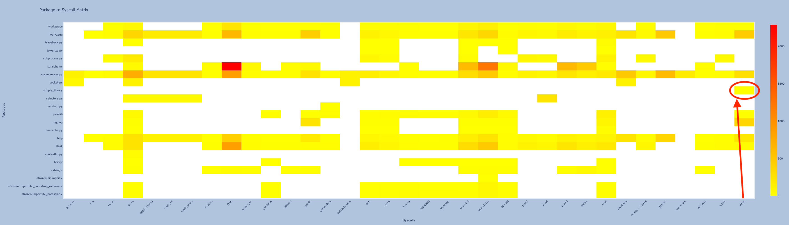

# Library Profiling PoC ⚔️

This is a ebpf-based sandbox PoC operating at the library level, in contrast to other available syscall sandboxing solutions like SELinux (LSM) or seccomp-BPF, which function at the process or application level.

**Credits**: I was mainly inspired from https://github.com/avilum/secimport (yet the implementation/logic is a bit different).



⚠️ 
- This project was not tested yet for heavy multithreading and concurrency. It will be done soon. I plan to test java and other languages as well
when I have some time. Also, do not use it in production, **this is a PoC**!!! 😏.
- If you don't start tracing you program from the start, it may generate false positives. 

# Environment 

The project include a base image [Dockerfile](Dockerfile) (can be built with [build.sh](build.sh)) that includes bcc and bpftrace toolings.

A python interpreter compiled with dtrace (to include usdt) is available at `/workspace/Python-3.10.0/python`. 
You also have another version of python available (`python3`). This version would be used for bcc. 
So each time you want to trace an application you **need** to use `/workspace/Python-3.10.0/python`
otherwise python3 is enough for other tasks like bcc (e.g for deploying the bpf program).

you can list python static probes using `bpftrace -l 'usdt:/workspace/Python-3.10.0/python:*'`.

# Demos 🎞️

-> www.deep-kondah.com/ebpf-library-profiling/

## Library Profiles 👁️

Each library's profile is characterized by the system calls that were observed when that specific library was active in the execution stack.
Of course, it does not mean that this library led to that system call, if you really want to infer that info, you need to do some provenance analysis. 

##  Deviation Detection 🕵️‍♀️

When a system call is about to be executed, the active libraries in the stack are checked against their profiles (was this library active when the system call happened during profiling ?).
A library deviation is reported when that library does not allow that specific system call.
This is crucial for ensuring that libraries are operating within their expected behaviors and not being used for malicious purposes (typically RCE but not only, think Log4Shell).

## Example Scenarios 🦠
    - Log4Shell: The JNDI library should not be active in the stack during certain system calls that it traditionally would not use. 
      The presence of JNDI during unusual system calls can be a red flag.
    - If you are using an Logging library, it should not be active in the stack when an critical system calls are issued like execv (e.g. only present in write).
      This is because it will print whatever needs to be printed and then it will exit. 


By monitoring the active libraries against their defined profiles during system calls, we can detect deviations that may indicate security breaches.
It provides a robust way to safeguard applications by ensuring that system calls are consistent with the expected library usage.
For example, Oligo Security is housing a huge knowledge about legitimate usage of Open source software or OSS, in this case you don't really 
need to do profiling, because they have done it for you. 

## Third Party Library PoC

For demonstration purposes, I published a simple library, [simple_library](simple_library), that you can publish it as follows:
`poetry publish --build`.

It is already available and can be installed using `pip install simple-library`. 
The idea is to implant a backdoor there, that would be activated under certain conditions (it is very naive but enough to illustrate the goal of this PoC); for example start a subprocess. 
We want our sandbox to detect such deviation when the library is not used according to the profile we granted to that specific library. 
Specifically, the library defines a function `out` that will print a message and deviate if instructed to do so.

```python
def out(m, deviate=False):
  print(m)
  if deviate:
   subprocess.call("ps")
```

We start by sandboxing the library using a benign usage, and then we rerun the application and see if the sandbox can detect such deviation. 

Lets go:
- First run `./run.sh`:
- Then generate a profile for your application (you can use bpftrace or bcc, bcc is more flexible + bpftrace can have cold start problem):

  ## Bpftrace
  - `export BPFTRACE_MAX_STRLEN=88` (if you want to support bigger than that use bcc version below)
  - Generate profile for your application:
   `bpftrace profile.bt -o trace.log` 
  - Let it run for a sufficient amount of time to gather the data you need (you need to execute all the paths within the application; execute all the features -> otherwise you will generate tons of false positives),
  - then terminate it with CTRL+C.
  - Now generate a sandbox `bt` file by running [generate_sandbox_from_profile.py](bpftrace%2Fprofile%2Fgenerate_sandbox_from_profile.py): 
  - Run the generated sandbox:
    `bpftrace --unsafe bpftrace/sandbox/generated_sandbox.bt` 
  - Try to exploit a vuln or backdoor that leads to a RCE, it should block it.
    
  - (bpftrace has a cold start problem when a large map needs to be initialized; it needs to parse every line ... this is why I switched to bcc below)

  ## BCC
  - Add process id in [generate_profile.py](bcc%2Fprofile%2Fgenerate_profile.py) and run:
    `python3 generate_profile.py`
  - Execute all the features part of the sandbox. E.g. run [main.py](web_application%2Fmain.py)
  - Now run generated [sandbox.py](bcc%2Fsandbox%2Fsandbox.py):
    `python3 sandbox.py`
  - It should block any deviation: 
    


## Notes

This is just a **PoC**, it may not be complete. I don't have enough time to properly test corner cases. 
Additionally, you may have false positives if you start tracing only after the application has started. 
I am not an eBPF expert, if you are, you can probably do better. 

